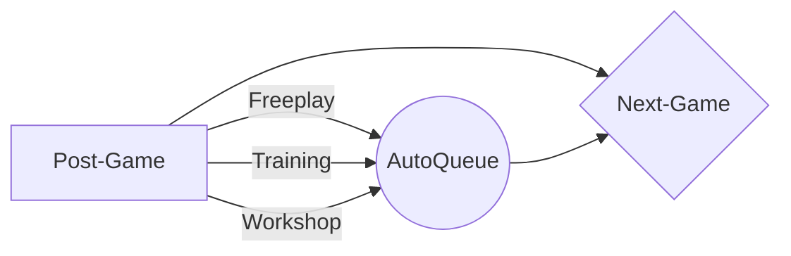

# PremierSuite - Rocket League Utility

**PremierSuite** is a rocket league - bakkesmod plugin for manipulating both server-side and client-side rendering and presets. 

> Other community-made **bakkesmod** plugins available [here](https://bakkesplugins.com/).

Any and all help is welcome for updates and features. Feel free to ask questions about the codebase on discord: Neuro#0618

### Custom Training Variables (C-Vars)

Just like you can change variables in bakkesmod i.e. ballspeed, trajectory, starting vector:

- Preload variables to load into training, freeplay or workshops with these presets.

- Debug ball/player: This interesting command allows players to print either their ball or player info on the console.
- Gamespeed1: Players can input values in the range of 0.01 to 10 and either decrease or increase the game speed.
- Writeconfig: This command allows you to make your key configuration changes permanent. You can do so by writing all the changes in the config file.
- Training_predictball: This command is really helpful while scoring. It draws a line and allows players to predict the ball’s trajectory.
- List maps: All the maps that are in the game are listed through this command.
-   Training_scoring 0|1: This is mainly for the Freeplay mode, which allows players to either keep their goal-scoring on or off.
-   Roadmap: As the name suggests, players can load any of the available maps. This can be used even in Freeplay mode.
-   Boost set|add|remove unlimited|limited|0-100: This command allows you to make unlimited changes to any boost.
-   Log keys 0|1: This command allows you to add all the keys to the console.
-   Alias alias name “action”: If you want to customize your command for any form of action, then use this command.
-   Torq X Y Z F: This command enables players to add a spin to their balls. You can input values between 0-6 to get a spin. You must try number 1 as it gives the best spin.

- The file synchronization will keep one file of the workspace synced with one or multiple files in **Google 
	> Common variables taken from Bakkesmod.org

## Server-side overview

